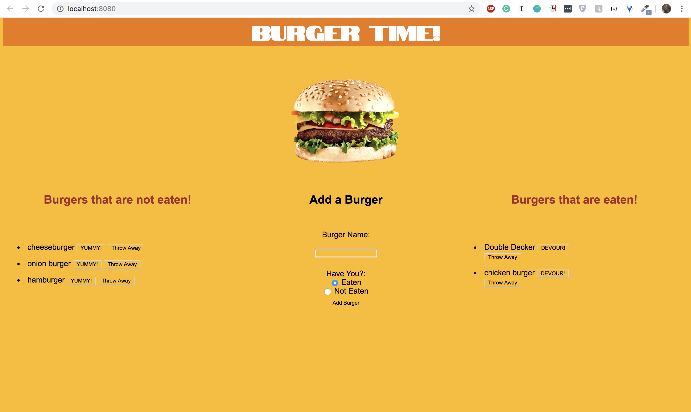

# burgerTime_Handlebars

Burger Time is a web app that allows the user to organize which burgers they have or have not eaten in the recent past. By inputting a burger, they are able to send it to a specific column with one simple click. They can transfer burgers to the next column by eating the burger. They can also get rid of burgers by throwing them away. 

# The App

The app consists of a single landing page split into 3 columns. The first column holds the burgers which are not yet eaten, the second column allows the user to add the burger into either column, and the third column holds the eaten burgers.  

# Technologies Used

- Javascript
- JQuery
- HTML/CSS
- Express.js
- node.js
- Handlebars
- mySQL

# Links 

* [Deployed GitHub](https://gelissa.github.io/burgerTime_Handlebars/)
* [GitHub Repo](https://github.com/gelissa/burgerTime_Handlebars)
* [Portfolio](https://gelissa.github.io/gelissaPortfolio/)
* [Heroku](https://evening-escarpment-88978.herokuapp.com/)